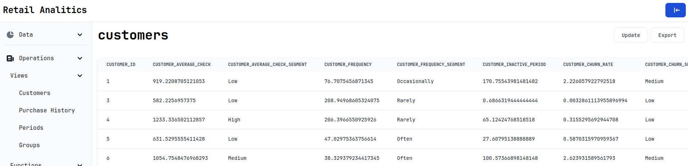

# RetailAnalistics

Full-stack project for working with a database storing market information.

## Content

This project is a full-fledged web application that allows you to work with a database of market information.

In essence, the project is a logical continuation of the project related to the development of a database
to store market information. [Database](https://github.com/sav1nbrave4code/RetailAnalistycsDB).

Implemented:
1. CRUD for all tables in the database
2. Calling functions and procedures in the database
3. Import and export tables to csv
4. Convenient web interface
5. Authorization
6. Query execution from various roles at the database level
7. Proxy server
8. Logging

What was used:
1. Frontend - `JS + React`
2. Backend - `Golang + Chi`
3. Database - `PostgreSQL`
4. Proxy - `Nginx`

All components of the project are launched in separate docker containers and united
in one layer using docker-compose.
Accordingly, docker and docker-compose are required to run this application.

The application uses the following ports:

1. 4500 - proxy (main)
2. 3000 - frontend
3. 8080 - backend
4. 5432 - database

To run the make application to clear the docker containers cache make clean.

## Users

As noted, the application implements authorization and execution of queries to the database from various roles.

Role credits:

| Role    | Logs    | Password |
|---------|---------|----------|
| admin   | admin   | admin    |
| visitor | visitor | visitor  |

Operations available for roles:

| Role    | Tables  | Views | Functions | Export | Import |
|---------|---------|-------|-----------|--------|--------|
| admin   | CRUD    | -RU-  | +         | +      | +      |
| visitor | -R--    | -R--  | +         | +      | -      |

## Web interface examples

Authorization

Table

Performance

Add to table

Removing from a table

