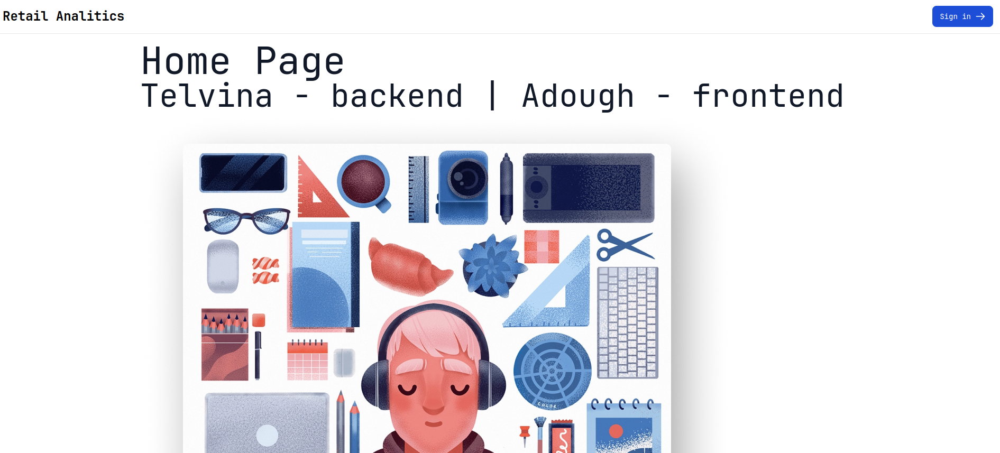
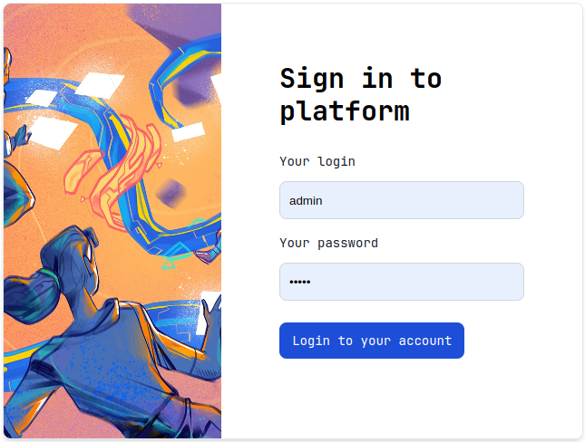
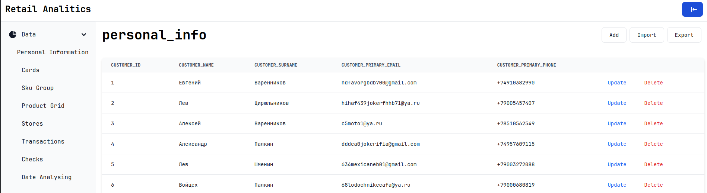
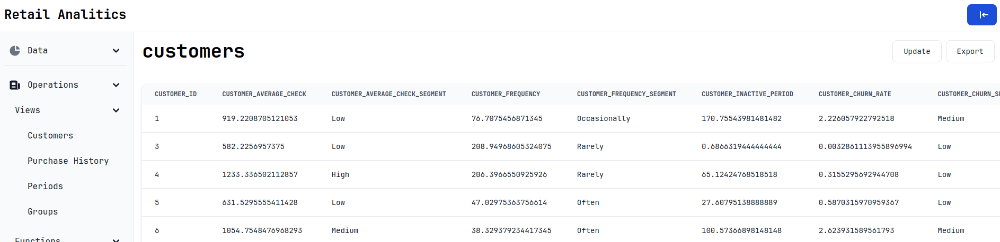
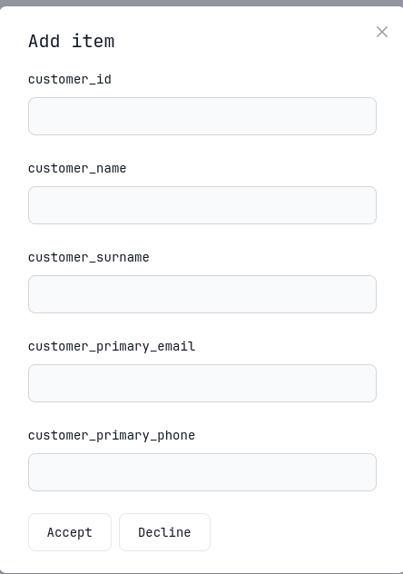
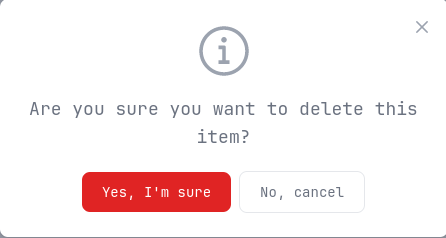

# RetailAnalistycs

Фул-стек проект для работы с базой данных, хранящей информацию о рынке.

## Содержание

Данный проект является полноценным веб приложением, позволяющим работать с базой информации о рынке.

По сути проект представляет собой логическое продолжение проекта, связанного с разработкой базы данных
для хранения информации о рынке. [База данных](https://github.com/sav1nbrave4code/RetailAnalistycsDB).

Реализованы:
1. CRUD для всех таблиц в базе данных
2. Вызов функций и процедур в базе данных
3. Импорт и экспорт таблиц в csv
4. Удобные веб-интерфейс
5. Авторизация
6. Исполнение запроса от различных ролей на уровне БД
7. Проксирующий сервер
8. Логирование

Что использовалось:
1. Frontend - `JS + React`
2. Backend - `Golang + Chi`
3. Database - `PostgreSQL`
4. Proxy - `Nginx`

Все составляющие проекта - запускаются в отдельных docker контейнерах и объеденины
в один слой с помощью docker-compose.
Соответственно для запуска данного приложения требуются docker и docker-compose.

Приложение использует следующие порты:

1. 4500 - proxy (основной)
2. 3000 - frontend
3. 8080 - backend
4. 5432 - database

Чтобы запустить приложение make, чтобы очистить кэш докер контейнеров make clean.

## Пользователи

Как было отмечено - в приложении реализованы авторизация и выполнение запросов к БД от различных ролей.

Креды для ролей:

| Роль    | Логи    | Пароль  |
|---------|---------|---------|
| admin   | admin   | admin   |
| visitor | visitor | visitor |

Операции доступные для ролей:

| Роль    | Таблицы | Представления | Функции | Экспорт | Импорт |
|---------|---------|---------------|---------|---------|--------| 
| admin   | CRUD    | -RU-          | +       | +       | +      |
| visitor | -R--    | -R--          | +       | +       | -      |

## Примеры веб интерфейса

Авторизация

Таблица

Представление

Добавление в таблицу

Удаление из таблицы

